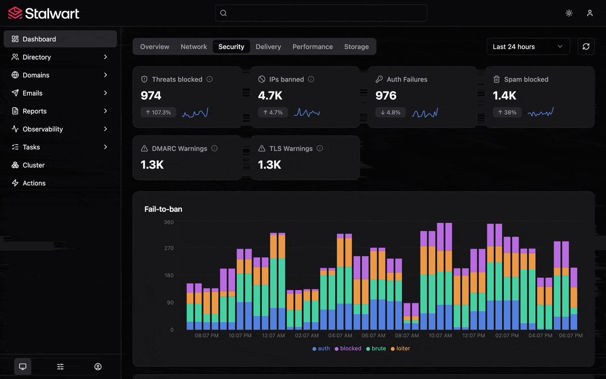

<p align="center">
    <a href="https://stalw.art">
    
    </a>
</p>

<h3 align="center">
  Web-based User Interface for Stalwart 🛡️
</h3>

<br>

<p align="center">
  <a href="https://github.com/stalwartlabs/webui/actions/workflows/build.yml"></a>
  &nbsp;
  <a href="https://www.gnu.org/licenses/agpl-3.0"></a>
  &nbsp;
  <a href="https://stalw.art/docs/get-started/"></a>
</p>
<p align="center">
  <a href="https://mastodon.social/@stalwartlabs"></a>
  &nbsp;
  <a href="https://twitter.com/stalwartlabs"></a>
</p>
<p align="center">
  <a href="https://discord.gg/jtgtCNj66U"></a>
  &nbsp;
  <a href="https://matrix.to/#/#stalwart:matrix.org"></a>
</p>

## Features

**Stalwart WebUI** is schema-driven single-page application for administering [Stalwart](https://stalw.art). After authentication the panel fetches a JSON schema from the server and dynamically generates all forms, lists, navigation, and layouts from that schema. Nothing is hardcoded.

Key features:

- **Schema-driven UI**: All forms, lists, and navigation are generated from a JSON schema fetched from `/api/schema` after login. No object types, field names, or layouts are hardcoded.
- **JMAP protocol**: All data operations (queries, creates, updates, deletes, blob uploads) use JMAP (RFC 8620) with method chaining and result references.
- **Permission-aware**: Every button, link, field, and section respects the user's permissions. Elements the user cannot access are hidden.

## Screenshots



## Get Started

Stalwart WebUI is included with Stalwart Mail Server, to install Stalwart Mail Server on your server by following the instructions for your platform:

- [Linux / MacOS](https://stalw.art/docs/install/linux)
- [Windows](https://stalw.art/docs/install/windows)
- [Docker](https://stalw.art/docs/install/docker)

All documentation is available at [stalw.art/docs/get-started](https://stalw.art/docs/get-started).

## Getting started

Prerequisites:

- Node.js 18 or later
- A running Stalwart instance (for JMAP API calls)

Install dependencies:

```
npm install
```

### Environment variables

Configuration is done through Vite environment variables. Copy or edit `.env.development` in the project root:

```
VITE_API_BASE_URL=http://localhost:443
VITE_OAUTH_CLIENT_ID=stalwart-webui
VITE_ACCESS_TOKEN=
VITE_OAUTH_SCOPES=
```

| Variable | Description |
|---|---|
| `VITE_API_BASE_URL` | URL of the Stalwart server. Used for all API requests during development. In production builds (when empty or unset) requests are relative to the current origin. |
| `VITE_OAUTH_CLIENT_ID` | OAuth 2.0 client ID. Defaults to `stalwart-webui`. |
| `VITE_ACCESS_TOKEN` | When set, skips the OAuth flow entirely and uses this token for all requests. Useful for local development and testing. |
| `VITE_OAUTH_SCOPES` | Optional OAuth scopes. Omitted from the authorization request when empty. |

### Bypassing OAuth for development

Set `VITE_ACCESS_TOKEN` to a valid bearer token to skip the login page and go straight to the admin panel. You can obtain a token from the Stalwart server's token endpoint or use an API key:

```
VITE_ACCESS_TOKEN=your-bearer-token-here
```

### Running the dev server

```
npm run dev
```

This starts Vite's development server with hot module replacement, typically at `http://localhost:5173`.

## Testing

Run the unit tests (Vitest):

```
npm test
```

Run tests in watch mode:

```
npm run test:watch
```

## Building for production

```
npm run build
```

This runs the TypeScript compiler followed by Vite's production build. Output
goes to the `dist/` directory.

To preview the production build locally:

```
npm run preview
```

## Support

If you are having problems running Stalwart Mail Server, you found a bug or just have a question,
do not hesitate to reach us on [Github Discussions](https://github.com/stalwartlabs/mail-server/discussions),
[Reddit](https://www.reddit.com/r/stalwartlabs), [Discord](https://discord.gg/aVQr3jF8jd) or [Matrix](https://matrix.to/#/#stalwart:matrix.org).
Additionally you may purchase a subscription to obtain priority support from Stalwart Labs LLC

## License

This project is dual-licensed under the **GNU Affero General Public License v3.0** (AGPL-3.0; as published by the Free Software Foundation) and the **Stalwart Enterprise License v1 (SELv1)**:

- The [GNU Affero General Public License v3.0](./LICENSES/AGPL-3.0-only.txt) is a free software license that ensures your freedom to use, modify, and distribute the software, with the condition that any modified versions of the software must also be distributed under the same license. 
- The [Stalwart Enterprise License v1 (SELv1)](./LICENSES/LicenseRef-SEL.txt) is a proprietary license designed for commercial use. It offers additional features and greater flexibility for businesses that do not wish to comply with the AGPL-3.0 license requirements. 

Each file in this project contains a license notice at the top, indicating the applicable license(s). The license notice follows the [REUSE guidelines](https://reuse.software/) to ensure clarity and consistency. The full text of each license is available in the [LICENSES](./LICENSES/) directory.
  
## Copyright

Copyright (C) 2024, Stalwart Labs LLC
